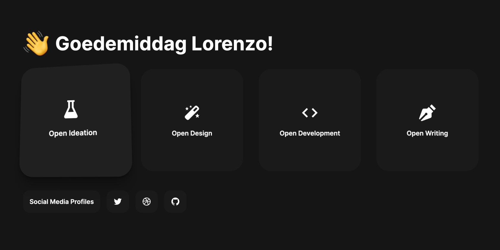

# Launcher

Check out the live version on: [launcher-lorenzo.vercel.app](https://launcher-lorenzo.vercel.app/)

Launcher is a startup page made with HTML, CSS and JavaScript. The page will wave and greet me and give several options for opening a collection of webpages to focus on work. Grouped by Ideation, Design, Development and writing, supporting system dark and light theme.

## Recources used

- [vanilla-tilt.js](https://github.com/micku7zu/vanilla-tilt.js) by [Șandor Sergiu](https://github.com/micku7zu)
- [Boxicons](https://github.com/atisawd/boxicons) by [Atisa](https://github.com/atisawd)

#

Feel free to reach out to me through email at [hey@lorenzodelijser.com](mailto:hey@lorenzodelijser.com) or on [Twitter](https://twitter.com/lorenzodelijser) if you have any questions or feedback. Special thanks to [Frank Roodnat](https://twitter.com/FrankRoodnat) for sparking this idea.
